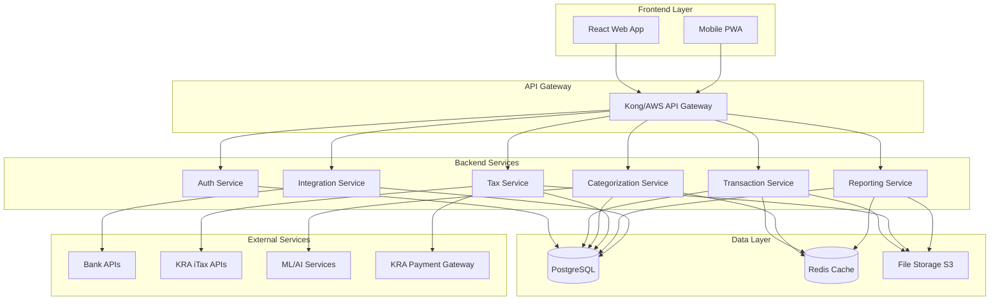
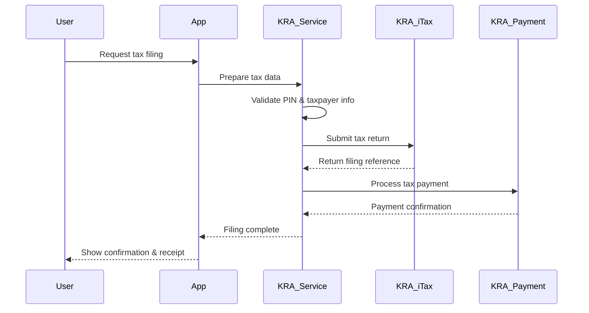

# Design Document

## Overview

The production finance application will be built as a modern, scalable web application using a microservices architecture with integrated KRA (Kenya Revenue Authority) tax services. The system will replace the current Streamlit-based application with a robust platform featuring a React frontend, FastAPI backend services, PostgreSQL database, and cloud-native deployment on AWS/Azure. The architecture emphasizes security, scalability, and maintainability while providing comprehensive financial management and KRA-compliant tax preparation capabilities for the Kenyan market.

## Architecture

### High-Level Architecture



### Technology Stack

**Frontend:**
- React 18 with TypeScript for type safety
- Next.js for server-side rendering and routing
- Tailwind CSS for responsive design
- Chart.js/D3.js for data visualizations
- React Query for state management and caching

**Backend:**
- FastAPI (Python) for high-performance APIs
- SQLAlchemy ORM for database operations
- Pydantic for data validation
- Celery for background task processing
- Redis for caching and session storage

**Database:**
- PostgreSQL for primary data storage
- Redis for caching and real-time data
- AWS S3 for file storage and backups

**Infrastructure:**
- Docker containers for all services
- Kubernetes for orchestration
- AWS/Azure for cloud hosting
- Terraform for infrastructure as code
- GitHub Actions for CI/CD

## Components and Interfaces

### 1. Authentication Service

**Purpose:** Handle user authentication, authorization, and session management

**Key Features:**
- JWT-based authentication with refresh tokens
- Multi-factor authentication (MFA)
- Role-based access control (RBAC)
- OAuth integration (Google, Microsoft)
- Password policies and security monitoring

**API Endpoints:**
```
POST /auth/login
POST /auth/logout
POST /auth/refresh
POST /auth/register
POST /auth/forgot-password
GET /auth/profile
PUT /auth/profile
```

### 2. Transaction Service

**Purpose:** Manage financial transactions, imports, and data processing

**Key Features:**
- Multi-format file import (CSV, OFX, QIF)
- Bank API integration via Open Banking
- Duplicate detection and deduplication
- Transaction validation and normalization
- Bulk operations and batch processing

**API Endpoints:**
```
GET /transactions
POST /transactions/import
PUT /transactions/{id}
DELETE /transactions/{id}
GET /transactions/search
POST /transactions/bulk-update
```

### 3. Categorization Service

**Purpose:** Automated transaction categorization using machine learning

**Key Features:**
- ML-based categorization engine
- Custom category hierarchies
- Learning from user corrections
- Confidence scoring
- Rule-based categorization fallback

**API Endpoints:**
```
POST /categorization/predict
PUT /categorization/correct
GET /categories
POST /categories
PUT /categories/{id}
DELETE /categories/{id}
```

### 4. Tax Service

**Purpose:** KRA tax preparation, calculation, and filing capabilities

**Key Features:**
- KRA tax form generation (Individual Income Tax, Withholding Tax, VAT returns)
- Kenyan tax deduction identification and optimization
- KRA tax calculation engine with current Kenyan tax rates
- KRA iTax system integration via official APIs
- Multi-year tax data management for KRA compliance
- PIN validation and taxpayer verification
- KRA payment integration and tracking

**API Endpoints:**
```
GET /tax/kra/forms/{year}
POST /tax/kra/calculate
GET /tax/kra/deductions
POST /tax/kra/file
GET /tax/kra/status/{filing-id}
POST /tax/kra/validate-pin
GET /tax/kra/payment-status/{payment-id}
POST /tax/kra/make-payment
```

### 5. Reporting Service

**Purpose:** Generate financial reports and analytics

**Key Features:**
- Customizable report templates
- Real-time dashboard data
- Export capabilities (PDF, Excel, CSV)
- Scheduled report generation
- Performance analytics

**API Endpoints:**
```
GET /reports/dashboard
POST /reports/generate
GET /reports/templates
POST /reports/schedule
GET /reports/export/{id}
```

### 6. Integration Service

**Purpose:** External service integrations and data synchronization

**Key Features:**
- Bank API connections
- Accounting software sync (QuickBooks, Xero)
- Payment processor integration
- Investment platform connections
- KRA iTax system integration
- Webhook handling

**API Endpoints:**
```
GET /integrations
POST /integrations/connect
PUT /integrations/{id}/sync
DELETE /integrations/{id}
GET /integrations/status
POST /integrations/kra/authenticate
GET /integrations/kra/taxpayer-info
```

### 7. KRA Integration Architecture

**Purpose:** Seamless integration with Kenya Revenue Authority systems

**Key Components:**
- **KRA API Client:** Handles authentication and API communication with KRA iTax
- **Tax Form Mapper:** Maps internal transaction data to KRA tax form formats
- **Compliance Engine:** Ensures all submissions meet KRA requirements
- **Payment Gateway Integration:** Handles tax payments through KRA-approved channels

**KRA API Integration Flow:**


**Supported KRA Services:**
- Individual Income Tax (Pay As You Earn - PAYE)
- Withholding Tax (WHT)
- Value Added Tax (VAT) for businesses
- Advance Tax payments
- Tax clearance certificate requests
- PIN validation and taxpayer verification
- Rental Income Tax
- Capital Gains Tax
- Turnover Tax for small businesses

**KRA API Authentication:**
- OAuth 2.0 flow for secure API access
- Client credentials for system-to-system communication
- Token refresh and management
- Rate limiting compliance with KRA API limits

**KRA Data Security:**
- End-to-end encryption for sensitive tax data
- Secure storage of KRA PINs and taxpayer information
- Audit trails for all KRA API interactions
- Compliance with KRA data protection requirements

## Data Models

### Core Entities

```python
# User Model
class User:
    id: UUID
    email: str
    password_hash: str
    first_name: str
    last_name: str
    is_active: bool
    created_at: datetime
    updated_at: datetime
    settings: UserSettings

# Account Model
class Account:
    id: UUID
    user_id: UUID
    name: str
    account_type: AccountType
    institution: str
    account_number: str (encrypted)
    balance: Decimal
    currency: str
    is_active: bool

# Transaction Model
class Transaction:
    id: UUID
    account_id: UUID
    date: date
    description: str
    amount: Decimal
    transaction_type: TransactionType
    category_id: UUID
    subcategory_id: UUID
    tags: List[str]
    is_tax_deductible: bool
    confidence_score: float
    created_at: datetime

# Category Model
class Category:
    id: UUID
    user_id: UUID
    name: str
    parent_id: UUID (nullable)
    color: str
    icon: str
    is_tax_category: bool
    tax_form_line: str (nullable)

# KRA Tax Filing Model
class KRATaxFiling:
    id: UUID
    user_id: UUID
    tax_year: int
    kra_pin: str (encrypted)
    filing_type: KRAFilingType  # Individual, Corporate, VAT, etc.
    forms_data: JSON
    calculated_tax: Decimal
    tax_due: Decimal
    payments_made: Decimal
    filing_date: datetime
    kra_reference: str
    status: KRAFilingStatus
    submission_receipt: str

# KRA Taxpayer Model
class KRATaxpayer:
    id: UUID
    user_id: UUID
    kra_pin: str (encrypted)
    taxpayer_name: str
    taxpayer_type: str  # Individual, Corporate
    registration_date: date
    tax_office: str
    is_verified: bool
    last_sync: datetime
```

### Database Schema Design

```sql
-- Indexes for performance
CREATE INDEX idx_transactions_user_date ON transactions(user_id, date DESC);
CREATE INDEX idx_transactions_category ON transactions(category_id);
CREATE INDEX idx_transactions_amount ON transactions(amount);

-- Partitioning for large datasets
CREATE TABLE transactions_2024 PARTITION OF transactions
FOR VALUES FROM ('2024-01-01') TO ('2025-01-01');
```

## Error Handling

### Error Response Format

```json
{
  "error": {
    "code": "VALIDATION_ERROR",
    "message": "Invalid transaction data",
    "details": {
      "field": "amount",
      "reason": "Amount must be a positive number"
    },
    "timestamp": "2024-01-15T10:30:00Z",
    "request_id": "req_123456"
  }
}
```

### Error Categories

1. **Validation Errors (400):** Invalid input data
2. **Authentication Errors (401):** Invalid credentials or expired tokens
3. **Authorization Errors (403):** Insufficient permissions
4. **Not Found Errors (404):** Resource not found
5. **Rate Limit Errors (429):** Too many requests
6. **Server Errors (500):** Internal system errors

### Error Handling Strategy

- Centralized error handling middleware
- Structured logging with correlation IDs
- Graceful degradation for non-critical features
- Circuit breaker pattern for external services
- Retry mechanisms with exponential backoff

## Testing Strategy

### Testing Pyramid

**Unit Tests (70%)**
- Service layer business logic
- Data validation and transformation
- Utility functions and helpers
- ML model predictions

**Integration Tests (20%)**
- API endpoint testing
- Database operations
- External service integrations
- Authentication flows

**End-to-End Tests (10%)**
- Critical user journeys
- Cross-service workflows
- UI functionality
- Performance benchmarks

### Testing Tools and Frameworks

- **Backend:** pytest, pytest-asyncio, factory_boy
- **Frontend:** Jest, React Testing Library, Cypress
- **API Testing:** Postman/Newman, pytest-httpx
- **Performance:** Locust, Artillery
- **Security:** OWASP ZAP, Bandit

### Test Data Management

- Anonymized production data for testing
- Factory patterns for test data generation
- Database seeding for consistent test environments
- Isolated test databases per test suite

## Security Considerations

### Data Protection

- AES-256 encryption for sensitive data at rest
- TLS 1.3 for data in transit
- Field-level encryption for PII
- Secure key management with AWS KMS/Azure Key Vault

### Authentication & Authorization

- JWT tokens with short expiration times
- Refresh token rotation
- Multi-factor authentication
- Role-based access control (RBAC)
- API rate limiting and throttling

### Compliance

- PCI DSS compliance for payment data
- SOC 2 Type II certification
- GDPR compliance for EU users
- Regular security audits and penetration testing

### Monitoring & Alerting

- Real-time security monitoring
- Anomaly detection for unusual access patterns
- Automated incident response
- Security event logging and analysis

## Performance Optimization

### Caching Strategy

- Redis for session data and frequently accessed data
- CDN for static assets
- Database query result caching
- API response caching with appropriate TTLs

### Database Optimization

- Proper indexing strategy
- Query optimization and monitoring
- Connection pooling
- Read replicas for reporting queries
- Partitioning for large tables

### Scalability Considerations

- Horizontal scaling with load balancers
- Microservices architecture for independent scaling
- Asynchronous processing for heavy operations
- Auto-scaling based on metrics

## Deployment Architecture

### Container Strategy

```dockerfile
# Multi-stage build for optimized images
FROM python:3.11-slim as builder
# Build dependencies and application

FROM python:3.11-slim as runtime
# Runtime environment with minimal dependencies
```

### Kubernetes Configuration

```yaml
apiVersion: apps/v1
kind: Deployment
metadata:
  name: transaction-service
spec:
  replicas: 3
  selector:
    matchLabels:
      app: transaction-service
  template:
    spec:
      containers:
      - name: transaction-service
        image: finance-app/transaction-service:latest
        resources:
          requests:
            memory: "256Mi"
            cpu: "250m"
          limits:
            memory: "512Mi"
            cpu: "500m"
```

### CI/CD Pipeline

1. **Code Commit:** Trigger automated pipeline
2. **Build:** Docker image creation and testing
3. **Test:** Automated test suite execution
4. **Security Scan:** Vulnerability assessment
5. **Deploy:** Staged deployment with health checks
6. **Monitor:** Post-deployment monitoring and alerting

This design provides a robust foundation for transforming your current Streamlit application into a production-ready financial platform with comprehensive tax filing capabilities, modern architecture, and enterprise-grade features.